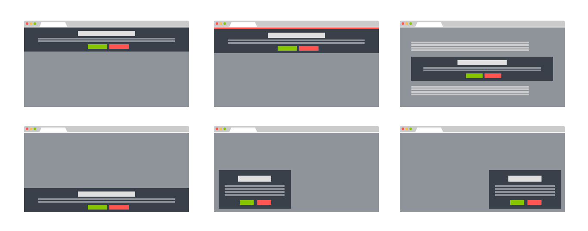
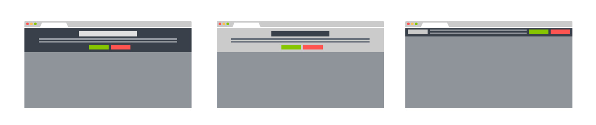

# jQuery EU Cookie Law popups

**An easy-to-install jQuery plugin to create EU Cookie Law popups and for GDPR compliance.**

Supports multiple layouts out of the box. Works well with Bootstrap. Easy to customize markup and CSS.

[Check out the live demos.](http://www.wimagguc.com/2018/05/gdpr-compliance-with-the-jquery-eu-cookie-law-plugin/)

**NEW** in demos: how to use this plugin for GDPR compliance?

## Get started

To get started, first include jQuery and import the plugin's files:

```
  <script src="https://code.jquery.com/jquery-3.3.1.min.js"></script>
  <link rel="stylesheet" type="text/css" href="css/jquery-eu-cookie-law-popup.css"/>
  <script src="js/jquery-eu-cookie-law-popup.js"></script>
```

(Mind you, you need to run the code on a webserver to be able to set cookies.)

## Simple popup

In its simplest form, you can add an EU Cookie Law popup by simply adding the "eupopup" classes to any HTML tag.

```
  <body class="eupopup eupopup-top">
```

### You can also choose from these layouts:



* Top of the page (“eupopup”, or “eupopup eupopup-top”)
* Fixed banner on top (“eupopup eupopup-fixedtop”)
* Fixed to bottom (“eupopup eupopup-bottom”)
* Fixed window, to bottom left (“eupopup eupopup-bottomleft”)
* Fixed window, bottom right (“eupopup eupopup-bottomright”)
* Inline (“eupopup eupopup-block”)


### And these colours or styles:



* White text on dark background ("eupopup-color-default")
* Dark text on light background ("eupopup-color-inverse")
* Compact ("eupopup-style-compact")


(See more options in the demo.html, or in the [live demo page](http://www.wimagguc.com/2018/05/gdpr-compliance-with-the-jquery-eu-cookie-law-plugin/).


## License

[MIT, do-with-the-code-whatever-you-please License](https://github.com/wimagguc/jquery-eu-cookie-law-popup/blob/master/LICENSE.md)

This code uses the jQuery Javascript library. To read more about it, go to [jquery.com](http://jquery.com/).


## About

Richard Dancsi

- Blog: [wimagguc.com](http://www.wimagguc.com/)
- Github: [github.com/wimagguc](http://github.com/wimagguc/)
- Twitter: [twitter.com/wimagguc](http://twitter.com/wimagguc/)
- Linkedin: [linkedin.com/in/richarddancsi](http://linkedin.com/in/richarddancsi)
- Google+: [plus.google.com/u/0/115939246085616544919](https://plus.google.com/u/0/115939246085616544919)
